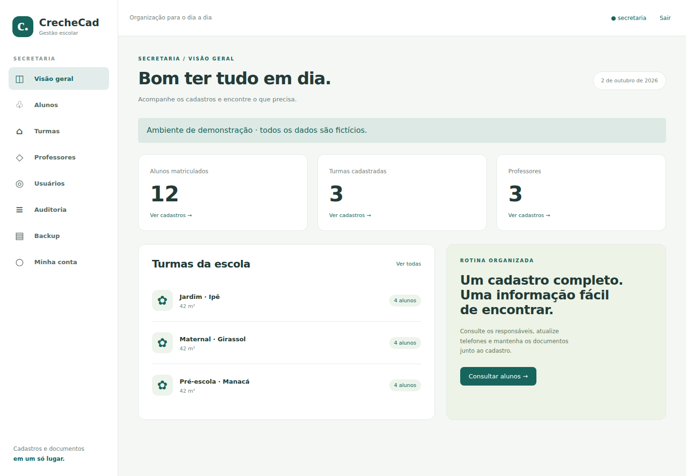
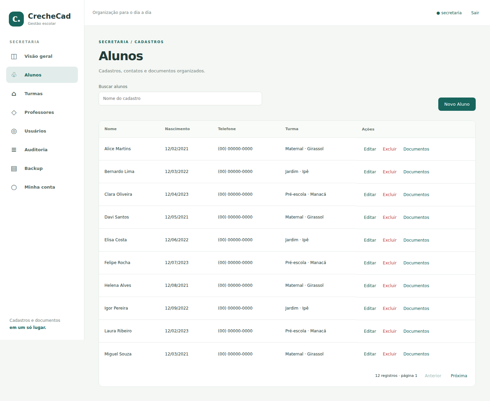
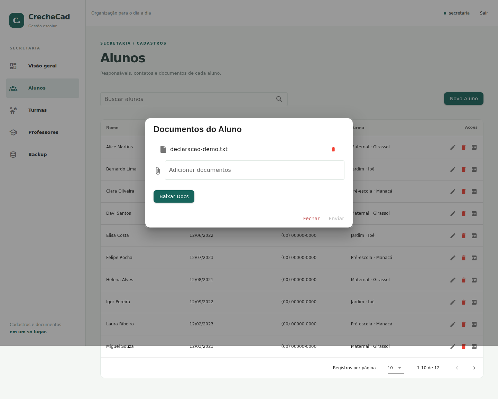
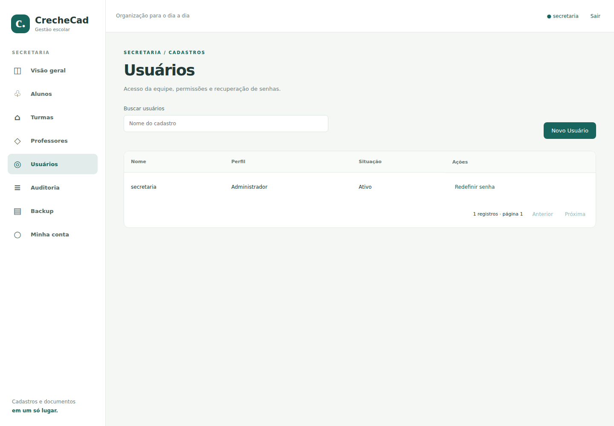
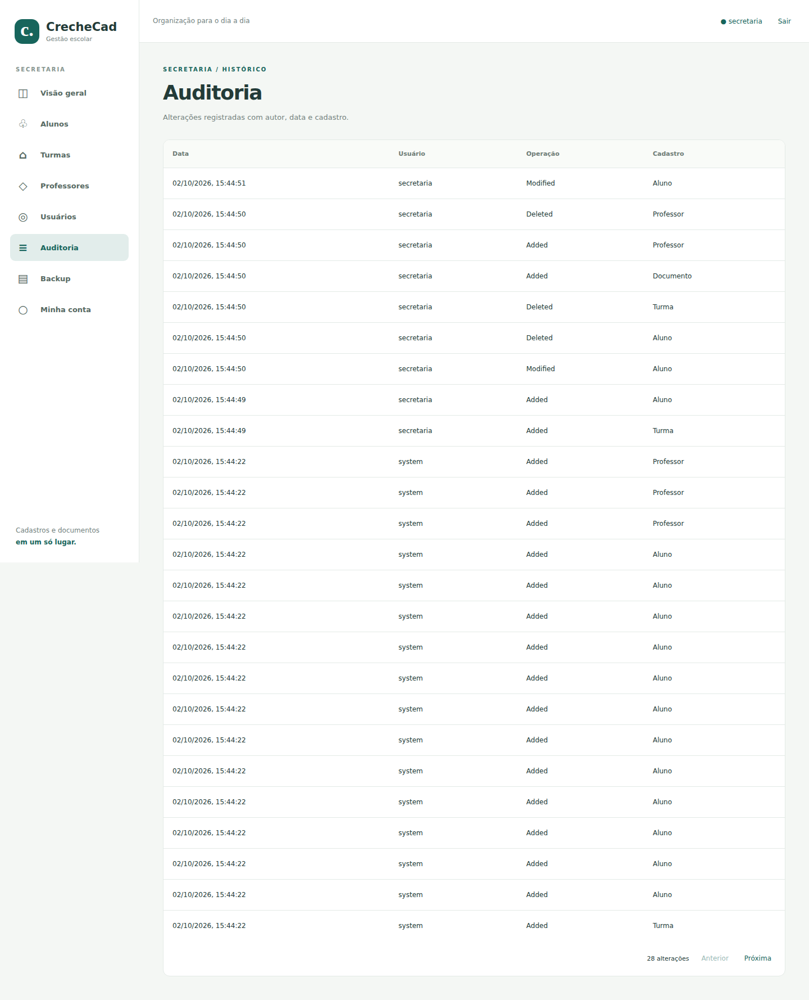
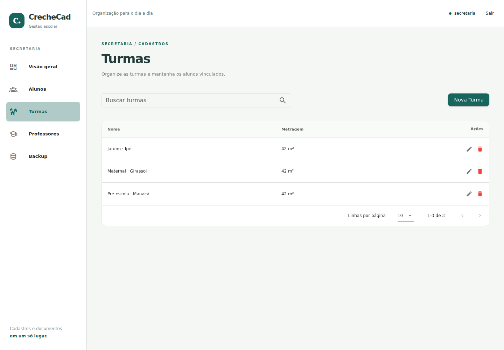
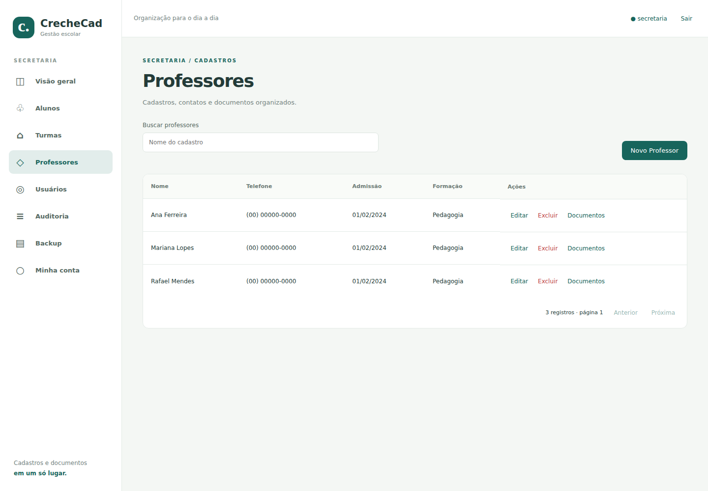
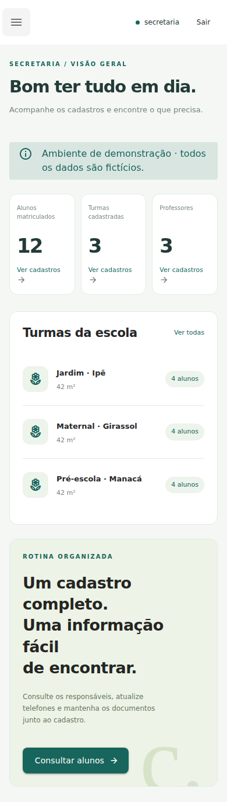
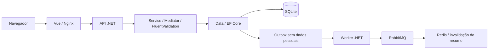

# CrecheCad

Aplicação para a rotina de uma secretaria escolar: alunos, turmas, professores, contatos e documentos. Desenvolvi o projeto em C# e Vue; nesta versão, atualizei a API para .NET 10 e a interface para Vue 3/Nuxt 4, com contas da equipe, permissões e histórico de alterações.

## Experimentar em cinco minutos

É necessário ter Git e Docker com Compose. A instalação compila a aplicação nos containers; não exige Node, .NET ou banco separados.

```sh
git clone https://github.com/LucianoNeo/creche_cad_backend_csharp.git
cd creche_cad_backend_csharp
cp .env.example .env
docker compose up --build --detach --wait
```

No PowerShell, use `Copy-Item .env.example .env`. Abra **http://localhost:8082** e entre com `secretaria` / `CrecheCad-Demo-2026!`. A demonstração cria apenas registros fictícios em um banco vazio.

1. Consulte os totais e as turmas na visão geral.
2. Crie uma turma, cadastre um aluno e edite seu telefone. Busque pelo nome e percorra as páginas.
3. Anexe um PDF, PNG, JPG ou TXT ao cadastro; baixe um arquivo ou todos em ZIP.
4. Em **Usuários**, crie uma conta com perfil Consulta. Entre com ela e confira que pode ler, mas não alterar cadastros.
5. Volte ao administrador, altere o perfil para Secretaria, redefina a senha ou desative a conta. Sessões antigas são invalidadas quando o acesso muda.
6. Consulte **Auditoria** e baixe uma cópia completa em **Backup**.

## Telas da aplicação

Capturas da aplicação executada com dados fictícios.







<details><summary>Equipe, auditoria, turmas, professores e celular</summary>











</details>

## Implementação

| Parte | Tecnologia / decisão |
| --- | --- |
| API | C# / ASP.NET Core .NET 10; controllers finos e composição de dependências |
| Domínio | Entidades e contratos sem dependência do banco ou da interface |
| Serviço | Casos de uso CQRS com Mediator e validação FluentValidation |
| Dados | EF Core, SQLite, migrations versionadas e outbox transacional |
| Cache e eventos | Redis para o resumo; RabbitMQ para invalidar o cache após alterações |
| Worker | Serviço separado que publica eventos persistidos e invalida o resumo; payload sem dados pessoais |
| Interface | Vue 3, Nuxt 4; SPA estática servida pelo Nginx |
| Acesso | PasswordHasher, cookie HttpOnly, CSRF, limitação de tentativas e revogação por alteração de acesso |
| Equipe | Administrador, Secretaria e Consulta; permissões verificadas no servidor |
| Registros | Busca e paginação no servidor; identificação de autor, operação e cadastro na auditoria |
| Arquivos | Validação de vínculo, tamanho, extensão e assinatura; download individual e ZIP |
| Execução | Docker Compose, processos sem root e volume persistente |



Escolhi SQLite para manter a instalação simples para uma escola. Os documentos ficam no mesmo banco e entram no backup. A consulta de alunos projeta o nome da turma junto ao cadastro; o backup usa a API de snapshot do SQLite. O histórico registra identificadores e operações, sem copiar senhas ou o conteúdo dos documentos.

A aplicação atende uma escola por instalação. Secretaria administra os cadastros; Consulta lê; Administrador também gerencia usuários, auditoria e backups. Uma turma com alunos precisa ser esvaziada antes da exclusão. Cada envio aceita até três arquivos de 5 MB.

Veja os [contratos e fluxos](docs/architecture.md).

## Contas e recuperação

A conta de `.env` inicializa o primeiro administrador. As demais contas são criadas em **Usuários** e ficam no banco. **Minha conta** permite mudar a própria senha.

**Esqueci minha senha** registra uma solicitação para a secretaria. O administrador vê as solicitações em Usuários e redefine a senha; a solicitação é encerrada e as sessões anteriores deixam de valer. Esse fluxo não depende de e-mail.

Se perder a senha do único administrador, defina uma nova `ADMIN_PASSWORD` em `.env` e execute:

```sh
docker compose stop api
docker compose run --rm api dotnet creche_cad.Api.dll --reset-admin
docker compose up -d
```

O comando restaura a conta indicada por `ADMIN_USERNAME`, preservando os cadastros.

## Dados e backup

`docker compose down` encerra a aplicação e mantém o volume `school-data`. `docker compose up -d` retoma a instalação. O volume guarda o SQLite e as chaves da sessão. `docker compose down --volumes` descarta o banco da demonstração.

O download de Backup é um SQLite completo. Para restaurá-lo, pare a API, substitua `/data/crechecad.db` no volume pela cópia e remova os arquivos `crechecad.db-wal` e `crechecad.db-shm` dessa instalação parada; então inicie novamente. Guarde os backups de forma privada: eles incluem cadastros e hashes de senha.

A configuração de avaliação publica somente em `127.0.0.1`. Para hospedar com dados próprios, configure HTTPS no proxy, senha administrativa própria e `DEMO_ENABLED=false`; nesse modo, os cookies exigem HTTPS. A versão anterior do banco foi retirada dos arquivos atuais e do contexto Docker. As capturas usam um banco novo; o histórico Git foi preservado.

## Verificação

Os testes de domínio e validação podem ser executados com o SDK .NET 10:

```sh
dotnet test tests/creche_cad.Tests/creche_cad.Tests.csproj
```

Os fluxos da aplicação também podem ser percorridos contra uma demonstração descartável com o Compose ativo. Eles verificam acesso, CSRF, CRUD, datas, vínculos, documentos, backup, recuperação, permissões, revogação, auditoria, paginação e navegação em telas de vários tamanhos:

```sh
npm ci
npm test
```

## English

CrecheCad is a school administration application with a C#/.NET 10 API and a Vue 3/Nuxt 4 interface. It manages students, classes, teachers and documents, with staff accounts, three permission levels, password changes, administrator-managed recovery, audit history and server-side search/pagination.

Clone the repository, copy `.env.example` to `.env`, run `docker compose up --build --detach --wait` and open **http://localhost:8082**. Use `secretaria` / `CrecheCad-Demo-2026!`. All seeded records are fictional. Only Git and Docker Compose are required.

SQLite data and session keys persist in a named volume. Migrations are versioned and applied at startup. Backups use SQLite's snapshot API. The solution separates API, Domain, Data, Service and Worker projects. Mediator handlers validate use cases with FluentValidation, Redis caches the dashboard summary, and a transactional outbox publishes a payload without student data to RabbitMQ so the worker can invalidate the cached summary. Local .NET and browser tests are documented above.
