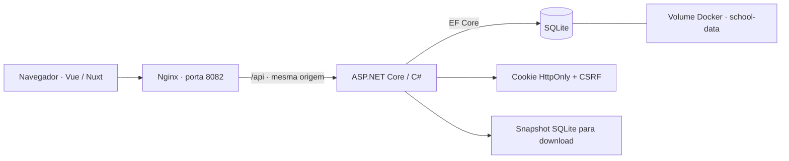

# Como a aplicação funciona

## Organização

- `src/creche_cad.Api`: controllers, autenticação, bootstrap e fixtures da demonstração.
- `src/creche_cad.Domain`: entidades, contratos de entrada e DTOs.
- `src/creche_cad.Data`: contexto, mapeamentos e migrations.
- `src/creche_cad.Service`: utilitário de formatação do projeto original; os fluxos atuais não dependem dele.
- `src/creche_cad.Api/client-app`: interface original em Vue/Nuxt, com a revisão de navegação e formulários.
- `tests`: verificações HTTP e navegação contra os containers completos.

Os controllers acessam o `DbContext` diretamente. Para esses cadastros, uma camada de repositórios repetiria os métodos do EF sem acrescentar uma regra de domínio. Operações de banco usam chamadas assíncronas e recebem o token de cancelamento da requisição.

## Sessão e acesso

`GET /api/auth/csrf` fornece um token para o navegador. O login exige esse token no header `X-CSRF-TOKEN` e valida a senha no servidor com o `PasswordHasher` do ASP.NET Core. Após o login, o navegador renova o token porque a identidade mudou. A sessão usa cookie HttpOnly; a senha não fica no bundle da interface e o token de CSRF fica em memória.

Os endpoints de cadastros e documentos exigem sessão. Backup e verificação do banco também exigem o papel `Administrator`. Há uma única conta por instalação, definida por variáveis de ambiente. Os endpoints públicos são saúde, obtenção do token CSRF e tentativa de login.

## Rotas principais

| Método | Rota | Uso |
| --- | --- | --- |
| POST | `/api/auth/login` | Iniciar sessão |
| GET | `/api/auth/me` | Restaurar a identidade ao recarregar |
| POST | `/api/auth/logout` | Encerrar sessão |
| GET / POST | `/api/aluno`, `/api/turma`, `/api/professor` | Listar e criar |
| GET / PUT / DELETE | `/api/{recurso}/{id}` | Consultar, editar e excluir |
| POST | `/api/documento/aluno/{id}/upload` | Anexar arquivos ao aluno |
| GET | `/api/documento/aluno/{id}/documentos` | Listar metadados dos anexos |
| GET | `/api/documento/aluno/{id}/download` | Baixar todos em ZIP |
| GET | `/api/documento/{id}/download` | Baixar um arquivo |
| DELETE | `/api/documento/{id}` | Excluir um anexo |
| GET | `/api/database/backup` | Baixar snapshot consistente |

As rotas de documentos também aceitam `professor` no lugar de `aluno`. Escritas exigem `X-CSRF-TOKEN`.

## Pontos que foram corrigidos

- O login anterior comparava credenciais no JavaScript, enquanto a API continuava pública.
- A busca de alunos consultava a turma individualmente para cada registro. Agora o EF gera uma projeção com JOIN.
- Um `TurmaId` inexistente causava erro interno; agora gera resposta de validação.
- A criação do professor copiava o telefone secundário para o celular. Os campos agora são independentes.
- A exclusão de turma com alunos é bloqueada antes de remover os registros.
- Os uploads têm limites, conferem o vínculo e o formato e removem caminhos do nome recebido.
- O backup deixou de copiar o arquivo aberto para um diretório fixo do Windows; usa o mecanismo de backup do SQLite e retorna um download autenticado.
- O processo deixou de abrir um navegador automaticamente e de fixar a porta da API no código.

## Migrations e evolução

As migrations originais são aplicadas na inicialização e verificadas com um banco vazio no CI. O modelo não recebeu novas colunas nesta revisão. O aviso de comparação de modelo do EF 10 é ignorado explicitamente, pois o snapshot foi gerado pelo EF 6; antes de alterar o esquema, será necessário atualizar esse snapshot e conferir a migration gerada.

O front continua em Vue/Nuxt 2. Ferramentas Nuxt ficam apenas na etapa de build; o container da interface executa Nginx e serve arquivos estáticos. Essa separação não elimina os alertas do ecossistema legado. A migração do front, usuários por funcionário e auditoria estão descritos como pendências no README.
