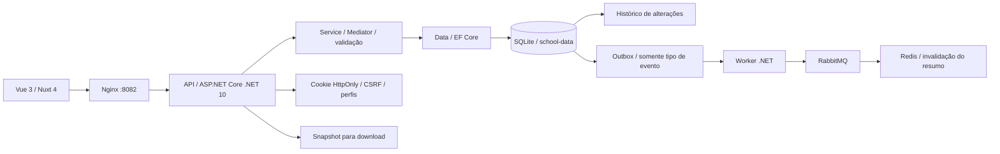

# Contratos e fluxos

## Organização

- `frontend/`: Vue 3/Nuxt 4, formulários, busca, paginação, documentos e administração.
- `src/creche_cad.Api`: controllers, acesso, bootstrap e dados fictícios.
- `src/creche_cad.Domain`: entidades, entradas e DTOs.
- `src/creche_cad.Data`: contexto, mapeamentos e migrations.
- `src/creche_cad.Service`: consultas e comandos CQRS, Mediator, pipeline de validação e regras FluentValidation.
- `src/creche_cad.Worker`: publicação do outbox e consumidor de invalidação do resumo.
- `tests/`: testes dos validadores e verificações da aplicação em Compose.

O resumo do Dashboard passa pela API, por uma consulta Mediator e por um leitor em Data. Redis guarda contagens e nomes das turmas por dois minutos; cada alteração escolar também grava um evento pequeno no mesmo SaveChanges dos dados e do histórico. O worker envia esse evento pelo RabbitMQ e remove as duas variantes da chave do resumo. O payload não contém nome, documento ou identificador de aluno.

FluentValidation verifica os modelos de aluno, turma e professor antes das ações MVC; regras de data, campos obrigatórios e limites de texto ficam nos validadores do projeto Service. As migrations são aplicadas pela API na inicialização e incluem a tabela do outbox.

A listagem de alunos continua assíncrona e projeta o nome da turma junto ao registro. O histórico é incluído no mesmo SaveChanges que altera os dados.

## Sessão

`GET /api/auth/csrf` fornece o token de CSRF. Login e escritas enviam `X-CSRF-TOKEN`. O login compara o hash no servidor e estabelece um cookie HttpOnly com prazo de duas horas. Cada requisição confere se a conta continua ativa e se o identificador de segurança coincide. Mudança de senha, perfil ou ativação invalida sessões existentes.

Administrador gerencia usuários, auditoria e backups. Secretaria altera cadastros e documentos. Consulta lê esses registros; a API bloqueia suas escritas mesmo que alguém manipule o navegador.

## Rotas

| Método | Rota | Uso |
| --- | --- | --- |
| POST | `/api/auth/login`, `/api/auth/logout` | Sessão |
| GET | `/api/auth/me`, `/api/auth/csrf` | Identidade e CSRF |
| POST | `/api/auth/change-password` | Alterar a própria senha |
| POST | `/api/auth/recovery` | Solicitar recuperação |
| GET / POST | `/api/aluno`, `/api/turma`, `/api/professor` | Busca paginada e criação |
| GET / PUT / DELETE | `/api/{recurso}/{id}` | Consulta, atualização e exclusão |
| GET / POST | `/api/users` | Equipe; lista paginada |
| PUT | `/api/users/{id}` | Perfil e situação da conta |
| POST | `/api/users/{id}/reset-password` | Nova senha e encerramento da recuperação |
| GET | `/api/users/recoveries`, `/api/users/audit` | Solicitações e auditoria paginada |
| GET | `/api/dashboard` | Totais e alunos por turma |
| POST | `/api/documento/aluno/{id}/upload` | Anexos; também aceita professor |
| GET | `/api/documento/aluno/{id}/documentos` | Metadados; também aceita professor |
| GET | `/api/documento/aluno/{id}/download` | ZIP; também aceita professor |
| GET / DELETE | `/api/documento/{id}` | Exclusão do anexo |
| GET | `/api/documento/{id}/download` | Download individual |
| GET | `/api/database/backup` | Snapshot autenticado |

Listas aceitam `page`, `pageSize` e `q` e devolvem `{items,total}`. O tamanho máximo da página é 100; a interface usa 10 registros. Auditoria usa 25 por página. Validações devolvem 400, referências inexistentes 404 e exclusão de turma ocupada 409.

## Esquema e arquivos

As migrations de 2024 são preservadas. `CompleteSchoolAccess` atualiza relacionamentos e adiciona usuários, solicitações e auditoria; a migration `AddSchoolChangeOutbox` registra alterações escolares para o worker. O snapshot está atualizado para EF Core 10 e toda a sequência continua versionada no Data.

Documentos são vinculados a um aluno ou professor existente, sem caminhos recebidos do navegador. O servidor valida extensão, assinatura e limites. O snapshot inclui cadastros, usuários, histórico e documentos. Somente Administrador pode baixá-lo.

O Nuxt é usado na compilação da SPA. O container final serve os arquivos estáticos com Nginx; não executa Node ou um servidor de desenvolvimento.
